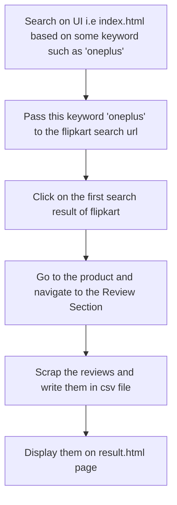

# Flipkart ReviewScrapper

Hosted on [http://reviewscrapper-bold-grysbok-nk.cfapps.io/](http://reviewscrapper-bold-grysbok-nk.cfapps.io/)  
The goal here originally was to create a dataset of flipkart reviews in the form of csv files  which can be further used for sentiment analysis. In addition, scrapped reviews are shown on the webpage using flask and csv files are formed when you execute this project in your system.

# Project Flow:

# Prerequisites:

The things needed for executing this  python based web scraper are: 
• Python (3.x) installed. 
• Anaconda installed. 
• A Python IDE (Integrated Development Environment): like PyCharm, Spyder, or any
other IDE of choice. 
• Flask Installed. (A simple command: pip install flask) 
• Basic understanding of Python and HTML. 

## Steps to execute this project in Pycharm/Anaconda Environment:

1. Create a new project in Pycharm. 
2. Make sure you select **New environment using :Conda** 
3. Click create and right click on the project name and select **Show In Explorer** option and go inside project name folder. 
4. Download this project and copy paste all these files into your flask project folder. 
5. Go to pycham terminal and type the following command:
	
	pip install -r requirements.txt
	
This command will install all the libraries such as flask,beautiful soup,etc. required to execute this project. 
6.Right click on flask_app.py file and select Run option.
****

